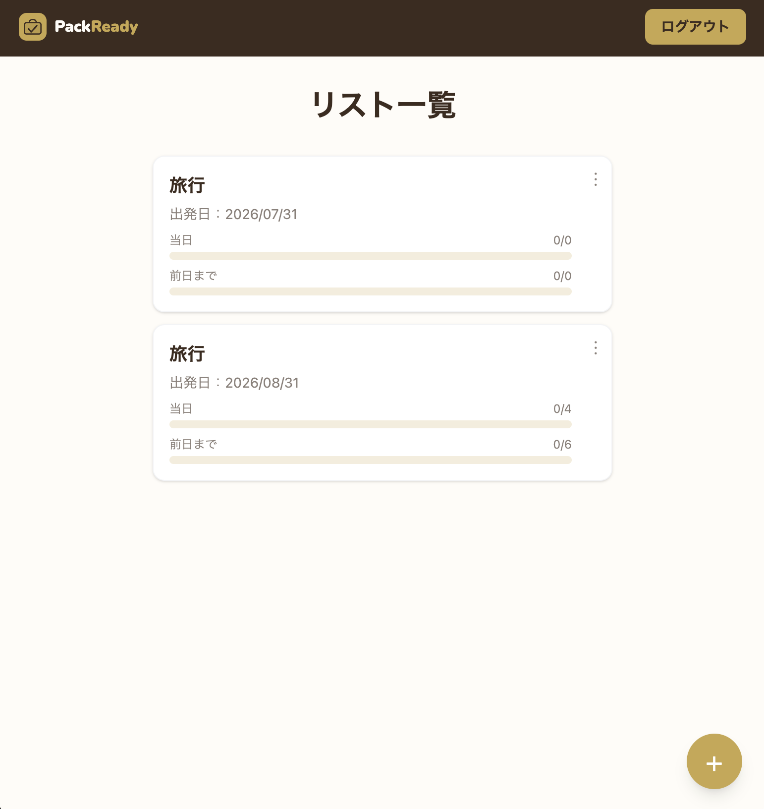
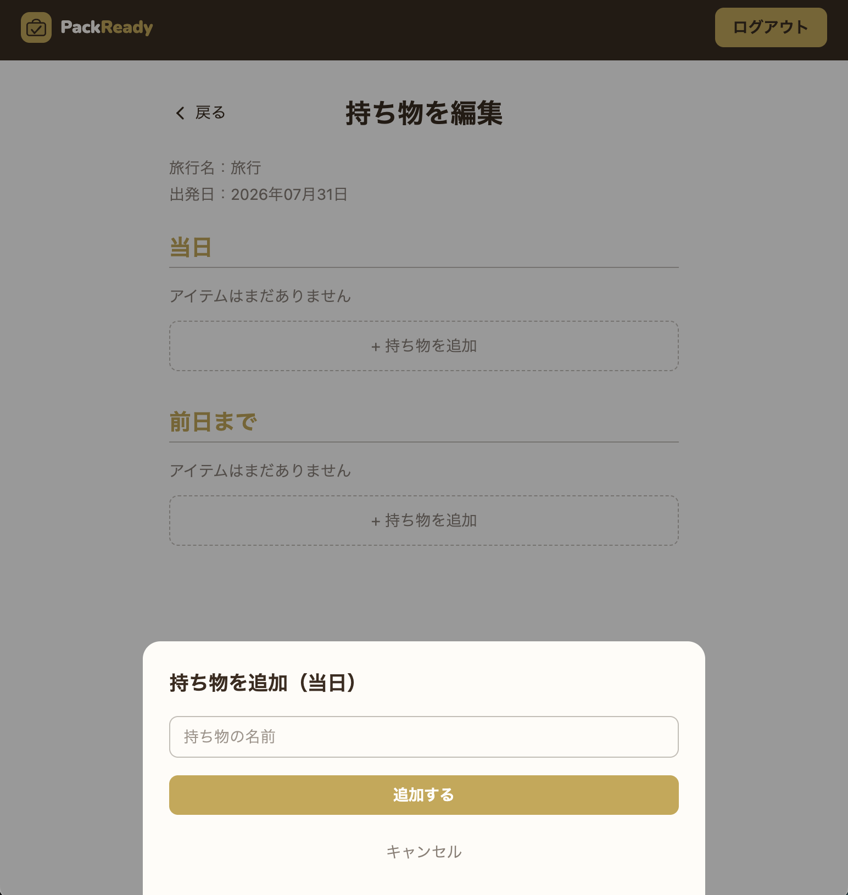
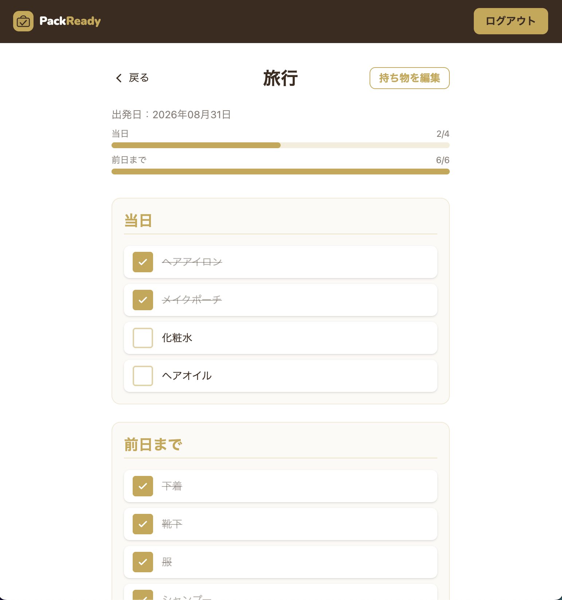

# PackReady
---

出発当日の朝に発生しやすい「持ち物の入れ忘れ」を防ぐ、パッキング特化型の管理アプリです。

## サービスURL
---
[https://packready.jp](https://packready.jp)

## 目次
---

- [このアプリで解決したいこと](#このアプリで解決したいこと)
- [主な機能](#主な機能)
- [使用技術](#使用技術)
- [差別化ポイント](#差別化ポイント)
- [今後の展望](#今後の展望)

## このアプリで解決したいこと
---

宿泊を伴う外出の当日の朝、ヘアアイロンやスマホの充電器など「直前まで使う物」をそのまま入れ忘れて出発してしまう、という経験が開発のきっかけです。

原因を振り返ると、忘れ物そのものではなく **「荷物に入れるタイミングが決まっていないこと」** が本質的な課題でした。前日までに準備できる物と、当日の朝まで使い続ける物が、準備の流れの中で区別されていなかったのです。

そこで本アプリでは、持ち物を「前日」「当日」という **使用タイミング軸** で整理し、準備の流れに沿ってチェックできる仕組みを提供します。

既存のリマインダー型アプリ(位置情報・通知で「思い出させる」タイプ)とは異なり、本アプリは通知による想起ではなく、**タイミングごとの整理による行動設計** に焦点を当てています。

## 主な機能
---

### 実装済み ✅

| 機能 | 概要 |
|---|---|
| ユーザー認証 | 新規登録・ログイン・ログアウト(Devise)。ユーザーごとにパッキングリストを管理し、他ユーザーのデータは閲覧不可 |
| LINEログイン | OmniAuthを用いたソーシャルログイン|
| パッキングリスト管理 | 外出ごとにリストを作成・編集・削除・一覧表示 |
| 持ち物管理 | リストごとに持ち物を追加・編集・削除し、「前日」「当日」に分類。チェックのON/OFFを保存 |
| AIによる持ち物提案 | Anthropic APIを利用し、行き先や日程に応じた持ち物候補を自動提案 |

### 追加予定の機能 
---

- 行き先の天気情報を取得し、AI提案に反映する
- 当日朝の未チェック項目をLINE通知でお知らせ
- 前回リストの複製機能
- よく使う持ち物候補の表示
- 購入が必要な持ち物の事前管理

---

| リスト一覧 | 持ち物登録(前日/当日) | 持ち物チェック |
|---|---|---|
|  |  |  

---

## 使用技術

| カテゴリ | 技術 |
|---|---|
| 言語 / フレームワーク | Ruby 3.2.7 / Ruby on Rails 7.1.5 |
| DB | PostgreSQL(本番: Neon) |
| フロントエンド | Hotwire(Turbo + Stimulus)、Tailwind CSS v4 |
| 認証 | Devise + OmniAuth(LINEログイン) |
| AI | Anthropic API |
| メール送信 | Resend |
| 開発環境 | Docker |
| デプロイ | Render |
| CI | GitHub Actions(RuboCop・RSpecを並列実行) |
| Lint | RuboCop |

---

## 差別化ポイント

- **リマインダー型ではなく行動設計型**: 通知で気づかせるのではなく、いつ荷物に入れるかを事前に決めておくことで、朝の身支度と荷造りが同時進行になっても迷わない状態を作ります
- **タイミング軸での分類**: 持ち物を「何を持っていくか」ではなく「いつ入れるか」で整理する点が、既存アプリとの主な違いです
- **AIによる個別提案**: 行き先や日程に応じてAIが持ち物を提案するため、タイミング分類済みの状態からリストが始まり、初回の入力負担を抑えられます

---

## 今後の展望

- AI提案精度向上
- 出発時間に応じたフェーズ表示機能
- 使用頻度に基づく持ち物候補の最適化

